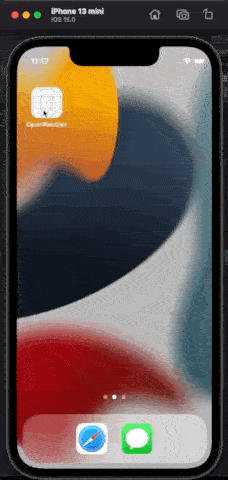

# Open Weather

This is a demo app of Open Weather APIs.

User can search weather via zip code or city name.

## Features

- Keep search history and selected locations
- Support AU / CA / US multiple region english display name and color theme
- Select city by current location
- Auto suggest city or zip code on typing
- Unit test for stub API provider with response json file

## Demo

|      Search & Delete       |        Multi region        |
| :------------------------: | :------------------------: |
|  |  |

## Requirement

Xcode 13 or above, iOS 15+

## Dependencies

- RxSwift
- Moya
- SnapKit
- SwiftyUserDefaults
- BackedCodable